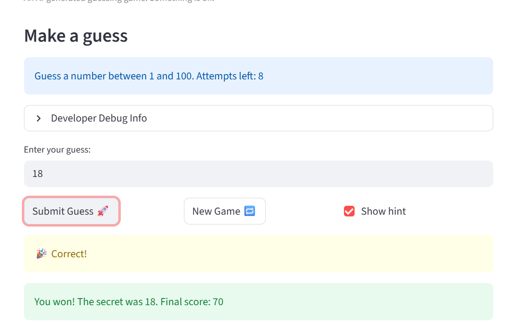

# 🎮 Game Glitch Investigator: The Impossible Guesser

## 🚨 The Situation

You asked an AI to build a simple "Number Guessing Game" using Streamlit.
It wrote the code, ran away, and now the game is unplayable. 

- You can't win.
- The hints lie to you.
- The secret number seems to have commitment issues.

## 🛠️ Setup

1. Install dependencies: `pip install -r requirements.txt`
2. Run the broken app: `python -m streamlit run app.py`

## 🕵️‍♂️ Your Mission

1. **Play the game.** Open the "Developer Debug Info" tab in the app to see the secret number. Try to win.
2. **Find the State Bug.** Why does the secret number change every time you click "Submit"? Ask ChatGPT: *"How do I keep a variable from resetting in Streamlit when I click a button?"*
3. **Fix the Logic.** The hints ("Higher/Lower") are wrong. Fix them.
4. **Refactor & Test.** - Move the logic into `logic_utils.py`.
   - Run `pytest` in your terminal.
   - Keep fixing until all tests pass!

## 📝 Document Your Experience

- [x] Describe the game's purpose.
  A number-guessing game where the player tries to guess a secret number within a limited number of attempts. Each guess returns a "Too High" or "Too Low" hint, and a score is tracked across attempts.

- [x] Detail which bugs you found.
  1. **Secret number kept changing** — `random.randint()` ran on every Streamlit rerun, generating a new secret each time the user clicked Submit.
  2. **Hints were backwards** — "Too High" showed "Go HIGHER!" and "Too Low" showed "Go LOWER!", the opposite of what they should say.
  3. **Attempt counter started at 1** — New games reset `attempts` to `1` instead of `0`, causing the first guess to count as the second attempt.

- [x] Explain what fixes you applied.
  1. Guarded `random.randint()` with `if "secret" not in st.session_state:` so the secret is only generated once per game session.
  2. Swapped the hint messages in `check_guess` so "Too High" says "Go LOWER!" and "Too Low" says "Go HIGHER!".
  3. Changed the new-game reset to set `attempts = 0` so attempt counting starts correctly.

## 📸 Demo

- [ ] [Insert a screenshot of your fixed, winning game here]

## 🚀 Stretch Features

- [ ] [If you choose to complete Challenge 4, insert a screenshot of your Enhanced Game UI here]
